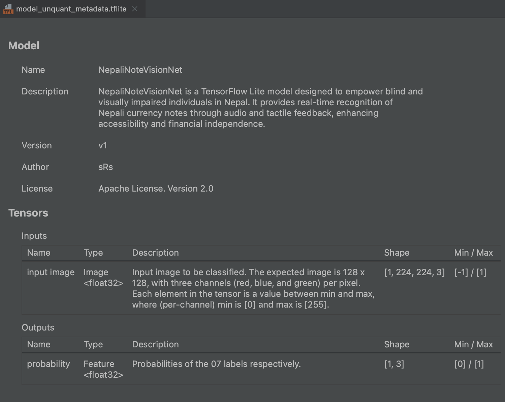

# Metadata-Writer-for-TensorFlow-Lite-Models
Metadata provides essential information about the model, making it easier for others to understand, integrate, and use your model in various applications.

Model Metadata: The tool will guide you through the process of adding metadata to your model. You can specify information about the model, input and output tensors, labels, and more.

Updated Model: Once the metadata is added, your model will be saved with metadata to the specified path.

Important Notes:

Metadata improves model documentation and interoperability.
The tool currently supports TensorFlow Lite models in flatbuffer format.

